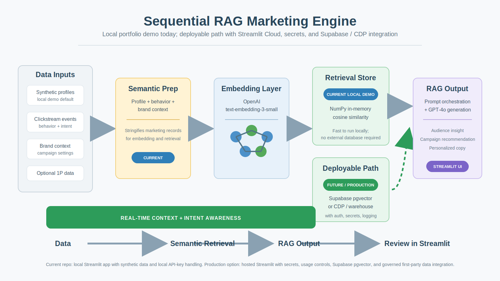
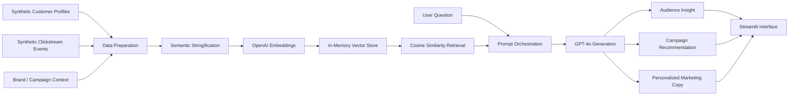

# Sequential RAG Marketing Engine

A local Streamlit prototype that uses synthetic customer behavior data, OpenAI embeddings, in-memory retrieval, and GPT-4o generation to explore audience insights and campaign recommendations.

## Why This Matters

Marketing teams often get trapped between two incomplete targeting approaches: static demographic segmentation or noisy behavioral signals. This project explores a more useful middle layer: combining customer attributes, clickstream behavior, and embedding-based retrieval so marketers can ask natural-language questions and receive context-aware audience and campaign recommendations.

## Walkthrough

Video walkthrough: [YouTube demo](https://www.youtube.com/watch?v=Q7uzjmP-3u0)

This repo is designed for local review today. A hosted Streamlit version is planned after adding safe API-key handling, access controls, and usage limits.

## What It Does

- Ingests synthetic customer profiles and behavioral events; users can adapt brand, audience, and campaign context through the sidebar.
- Converts customer/context records into searchable embeddings.
- Retrieves relevant audience and activity patterns with in-memory cosine similarity.
- Uses GPT-4o to generate marketing copy and recommendations from retrieved context.
- Supports natural-language questions about audience behavior, campaign opportunities, and personalization ideas.

## Example Use Cases

- "Which customer segment shows stronger purchase intent?"
- "What campaign angle should we test for high-engagement users?"
- "Which behavioral signals suggest cross-sell opportunity?"
- "How should we personalize messaging for a specific audience cluster?"

## Architecture



Mermaid version for markdown viewers without SVG support:



## Workflow

1. **Prepare synthetic marketing data**  
   Customer profiles, behavioral records, and campaign context are generated into a format suitable for retrieval.

2. **Create embeddings**  
   Records are embedded with `text-embedding-3-small` so semantically similar audience signals can be retrieved even when exact keywords do not match.

3. **Retrieve relevant context**  
   A user question triggers cosine-similarity retrieval from the in-memory vector store.

4. **Generate insight and copy**  
   GPT-4o receives the user question plus retrieved context and generates marketing-oriented recommendations or copy.

5. **Explore recommendations**  
   The Streamlit UI makes the workflow accessible for non-technical marketing users.

## Product Thinking

This project is not just a technical RAG demo. It is designed around a marketing workflow:

- Marketers ask questions in natural language.
- Retrieved context grounds the response in customer behavior.
- Output is framed as audience insight, campaign idea, or personalization direction.
- The interface supports exploration rather than one-off prompt generation.

## What This Is Not

This is a prototype, not a production marketing platform.

Current limitations:

- Single-user local prototype.
- In-memory / local data flow.
- OpenAI-oriented implementation.
- Synthetic data only by default.
- No production CDP or warehouse ingestion.
- No prompt versioning.
- No automated evaluation loop.
- No channel-specific output variants yet.
- No live activation into marketing platforms.

## Roadmap: Named Production Gaps

Four production gaps stand between this prototype and operator-grade tooling for an LLM-in-marketing stack. Each roadmap item below addresses a specific gap that AI-platform reviewers may probe for.

1. **Prompt versioning addresses stochastic-output drift.**  
   Store prompts as versioned artifacts; route a percentage of generation requests through experimental templates; log outputs for comparison. This lets a marketing team iterate on tone and structure without redeploying, and surfaces when output quality silently degrades after a change.

2. **Evaluation loop addresses lack of regression testing.**  
   Pair LLM-as-judge scoring for output quality, brand-voice adherence, factual grounding, and marketing usefulness with periodic human spot checks. This catches retrieval-relevance regressions before they reach campaigns.

3. **Channel-specific output variants address format heterogeneity across channels.**  
   Use the same retrieved context, then generate variants for email subject lines, SMS, landing pages, lifecycle messages, and sales enablement snippets. Today's single-output design assumes channel-agnostic copy, which is the exception, not the rule.

4. **Live CDP / warehouse ingestion addresses stale audience data.**  
   Replace the synthetic generator with a Segment/Rudderstack-shaped event stream consumer, paired with a persistent vector store such as Supabase, Pinecone, or pgvector. The embedding index should update as users behave, not only when the app restarts.

5. **Role-based interface broadens operator accessibility.**  
   Adapt views for growth marketers, lifecycle marketers, product marketing, and marketing operations. Today's UI assumes a single power-user persona.

Items 1 through 4 close named production gaps. Item 5 broadens who can use the system once those gaps are closed.

## Tech Stack

- **Language & UI:** Python, Streamlit
- **Embeddings:** OpenAI `text-embedding-3-small`
- **Generation:** OpenAI `gpt-4o`
- **Vector store:** NumPy in-memory cosine similarity; resets on app restart (see Roadmap item 4)
- **Data:** Synthetic clickstream + demographics generator; no Kaggle account or CDP required
- **Local config:** `python-dotenv` for local API-key handling
- **Deployment target:** Streamlit Community Cloud, planned with secrets, password gate, and usage limits

## Built with AI Assistance

This project was developed collaboratively with AI tools, each contributing at different stages:

| AI | Role |
|---|---|
| **Google Gemini** | Early ideation and architecture design for the Colab prototype |
| **ChatGPT (GPT-4o)** | Initial Colab script development and pipeline structuring |
| **Claude (Anthropic)** | Refactoring into a local Streamlit app, brand-agnostic generalization, and code quality improvements |
| **Codex** | README calibration, public-portfolio framing, and architecture diagram cleanup |

The collaborative workflow itself reflects how marketing teams can realistically use AI tools today: human judgment owns the strategy, AI accelerates the build.

## Repository Structure

```text
.
|-- app.py
|-- rag_engine.py
|-- assets/
|   |-- architecture_codex.svg
|   |-- demo-setup.png
|   |-- demo-indexing.png
|   |-- demo-query.png
|   |-- demo-retrieval.png
|   |-- demo-semantic-context.png
|   `-- demo-content-generation.png
|-- requirements.txt
|-- Sequential_RAG_Marketing_Engine.ipynb
`-- README.md
```

## Run Locally

```bash
git clone https://github.com/sunnyskydream/Sequential-RAG-Marketing-Engine.git
cd Sequential-RAG-Marketing-Engine
pip install -r requirements.txt
streamlit run app.py
```

Set your OpenAI API key locally before running:

```bash
OPENAI_API_KEY=your_api_key_here
```

You can also paste the key into the Streamlit sidebar during local testing. Do not commit API keys to GitHub.

## Notes

This is an independent portfolio project. It uses synthetic data and is intended to demonstrate AI workflow design, marketing analytics thinking, and retrieval-augmented generation for audience insight use cases.
