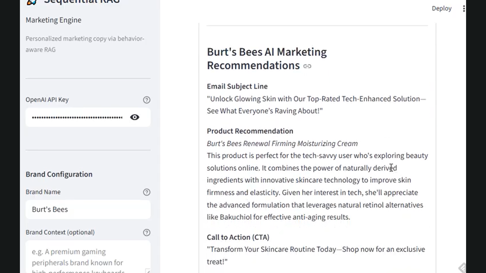
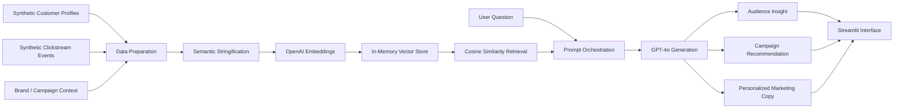

# Sequential RAG Marketing Engine

A Streamlit prototype that uses synthetic customer behavior data, OpenAI embeddings, in-memory retrieval, and GPT-4o generation to explore audience insights and campaign recommendations.

## Why This Matters

Marketing teams often get trapped between two incomplete targeting approaches: static demographic segmentation or noisy behavioral signals. This project explores a more useful middle layer: combining customer attributes, clickstream behavior, and embedding-based retrieval so marketers can ask natural-language questions and receive context-aware audience and campaign recommendations.

## What This Project Demonstrates

- AI-enabled marketing workflow design
- RAG architecture and prompt orchestration
- Audience and behavioral-signal reasoning
- Evaluation and productionization planning
- Technical-to-marketing translation

## Walkthrough

**Live demo:** [sequential-rag-marketing-engine.streamlit.app](https://sequential-rag-marketing-engine-ksuzuwyqhobpdpesvpnxjp.streamlit.app/) — password-gated to protect API usage; the access password is shared in applications and interviews. You can also run the app locally in two minutes (see [Run Locally](#run-locally)).



Video walkthrough: [YouTube demo](https://www.youtube.com/watch?v=Q7uzjmP-3u0)

## What It Does

- Ingests synthetic customer profiles and behavioral events; users can adapt brand, audience, and campaign context through the sidebar.
- Converts customer/context records into searchable embeddings.
- Retrieves relevant audience and activity patterns with in-memory cosine similarity.
- Uses GPT-4o to generate marketing copy and recommendations from retrieved context.
- Supports natural-language questions about audience behavior, campaign opportunities, and personalization ideas.

## Example Use Cases

- "Which customer segment shows stronger purchase intent?"
- "What campaign angle should we test for high-engagement users?"
- "Which behavioral signals suggest cross-sell opportunity?"
- "How should we personalize messaging for a specific audience cluster?"

## Architecture


Mermaid version for markdown viewers without SVG support:



**Note on the current single-store design.** The prototype vectorizes demographic and clickstream signals into one combined store for retrieval simplicity. For production, a two-store split (static demographics + rolling clickstream window) is a cleaner architecture — see Roadmap item 4 for the rationale.

## Workflow

1. **Prepare synthetic marketing data**
   Customer profiles, behavioral records, and campaign context are generated into a format suitable for retrieval.

2. **Create embeddings**
   Records are embedded with `text-embedding-3-small` so semantically similar audience signals can be retrieved even when exact keywords do not match.

3. **Retrieve relevant context**
   A user question triggers cosine-similarity retrieval from the in-memory vector store.

4. **Generate insight and copy**
   GPT-4o receives the user question plus retrieved context and generates marketing-oriented recommendations or copy.

5. **Explore recommendations**
   The Streamlit UI makes the workflow accessible for non-technical marketing users.

## Product Thinking

This project is not just a technical RAG demo. It is designed around a marketing workflow:

- Marketers ask questions in natural language.
- Retrieved context grounds the response in customer behavior.
- Output is framed as audience insight, campaign idea, or personalization direction.
- The interface supports exploration rather than one-off prompt generation.

## What This Is Not

This is a prototype, not a production marketing platform.

Current limitations:

- Single-user local prototype.
- In-memory / local data flow.
- OpenAI-oriented implementation.
- Synthetic data only by default.
- No production CDP or warehouse ingestion.
- No prompt versioning.
- No automated evaluation loop.
- No constraint-validation layer.
- No source-signal transparency at output time.
- No channel-specific output variants yet.
- No live activation into marketing platforms.

## Roadmap: Named Production Gaps

Seven gaps stand between this prototype and operator-grade tooling for an LLM-in-marketing stack. Each item names the specific production gap it closes:

1. **Prompt versioning** → stochastic-output drift
2. **Evaluation loop + constraint-validation** → lack of regression testing and unsafe outputs
3. **Channel-specific output variants** → format heterogeneity across channels
4. **Live CDP ingestion + two-store architecture** → stale audience data and recompute cost
5. **Source-signal transparency** → output-trust erosion
6. **Reference marketers as few-shot exemplars** → cold-start weakness
7. **Role-based interface** → single-persona accessibility ceiling

Full rationale, design sketches, and trade-offs for each item: **[docs/roadmap.md](docs/roadmap.md)**.

## Tech Stack

- **Language & UI:** Python, Streamlit
- **Embeddings:** OpenAI `text-embedding-3-small`
- **Generation:** OpenAI `gpt-4o`
- **Vector store:** NumPy in-memory cosine similarity; resets on app restart (see Roadmap item 4)
- **Data:** Synthetic clickstream + demographics generator; no Kaggle account or CDP required
- **Config:** `python-dotenv` for local API-key handling; `st.secrets` for hosted deployment
- **Deployment:** Streamlit Community Cloud — secrets-managed API key + password gate (`APP_PASSWORD` in secrets)

## Ownership and AI Assistance

I designed the system architecture, prompt strategy, workflow orchestration, retrieval approach, and Streamlit interface. AI tools accelerated implementation, refactoring, testing, and documentation — the same human-owns-strategy, AI-accelerates-the-build workflow a marketing team can use today.

| AI | Where it accelerated the build |
|---|---|
| **Google Gemini** | Early ideation and brainstorming for the Colab prototype |
| **ChatGPT (GPT-4o)** | Initial Colab script drafting and pipeline scaffolding |
| **Claude (Anthropic)** | Refactoring into a local Streamlit app, brand-agnostic generalization, and code quality |
| **Codex** | README calibration, public-portfolio framing, and architecture diagram cleanup |

## Repository Structure

```text
.
|-- app.py
|-- rag_engine.py
|-- docs/
|   `-- roadmap.md
|-- assets/
|   |-- architecture_codex.svg
|   |-- demo-setup.png
|   |-- demo-indexing.png
|   |-- demo-query.png
|   |-- demo-retrieval.png
|   |-- demo-semantic-context.png
|   `-- demo-content-generation.png
|-- requirements.txt
|-- Sequential_RAG_Marketing_Engine.ipynb
`-- README.md
```

## Run Locally

```bash
git clone https://github.com/sunnyskydream/sequential-rag-marketing-engine.git
cd sequential-rag-marketing-engine
pip install -r requirements.txt
streamlit run app.py
```

Set your OpenAI API key locally before running:

```bash
OPENAI_API_KEY=your_api_key_here
```

You can also paste the key into the Streamlit sidebar during local testing. Do not commit API keys to GitHub.

## Notes

This is an independent portfolio project. It uses synthetic data and is intended to demonstrate AI workflow design, marketing analytics thinking, and retrieval-augmented generation for audience insight use cases.
