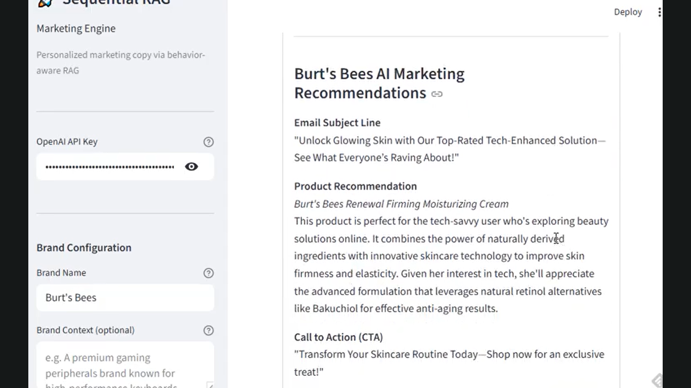
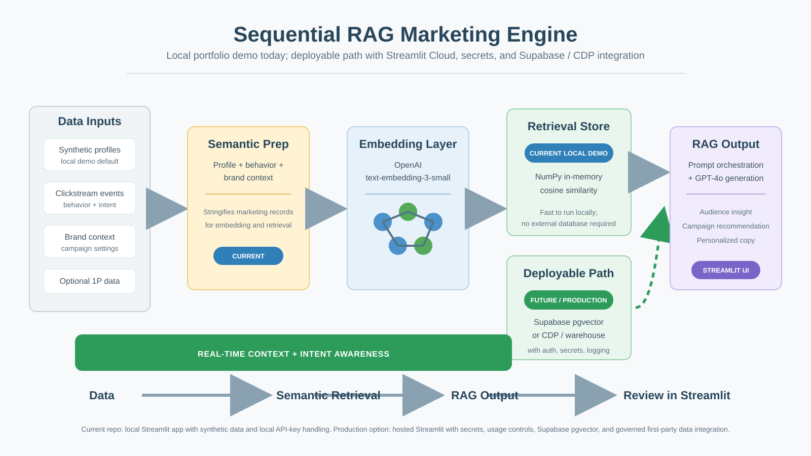
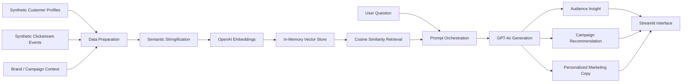

# Sequential RAG Marketing Engine

A Streamlit prototype that uses synthetic customer behavior data, OpenAI embeddings, in-memory retrieval, and GPT-4o generation to explore audience insights and campaign recommendations.

## Why This Matters

Marketing teams often get trapped between two incomplete targeting approaches: static demographic segmentation or noisy behavioral signals. This project explores a more useful middle layer: combining customer attributes, clickstream behavior, and embedding-based retrieval so marketers can ask natural-language questions and receive context-aware audience and campaign recommendations.

## What This Project Demonstrates

- AI-enabled marketing workflow design
- RAG architecture and prompt orchestration
- Audience and behavioral-signal reasoning
- Evaluation and productionization planning
- Technical-to-marketing translation

## Walkthrough

**Video walkthrough (no API key required):** [Watch the complete demo on YouTube](https://www.youtube.com/watch?v=Q7uzjmP-3u0).

**Live demo:** [sequential-rag-marketing-engine.streamlit.app](https://sequential-rag-marketing-engine-ksuzuwyqhobpdpesvpnxjp.streamlit.app/) — openly reachable. Bring your own OpenAI API key to build the vector index and generate content; the app has no shared server-side key. You can also run it locally in two minutes (see [Run Locally](#run-locally)).



The demo retrieves the closest-matching profiles and shows each with its similarity score and matched context. Copy is generated for the top match; the remaining matches display their context only.

## What It Does

- Ingests synthetic customer profiles and behavioral events; users can adapt brand, audience, and campaign context through the sidebar.
- Converts customer/context records into searchable embeddings.
- Retrieves relevant audience and activity patterns with in-memory cosine similarity.
- Uses GPT-4o to generate marketing copy and recommendations from retrieved context.
- Supports natural-language questions about audience behavior, campaign opportunities, and personalization ideas.

## Example Use Cases

- "Which customer segment shows stronger purchase intent?"
- "What campaign angle should we test for high-engagement users?"
- "Which behavioral signals suggest cross-sell opportunity?"
- "How should we personalize messaging for a specific audience cluster?"

## Architecture



Mermaid version for markdown viewers without SVG support:


```mermaid
flowchart LR
    A[Synthetic Customer Profiles] --> D[Data Preparation]
    B[Synthetic Clickstream Events] --> D
    C[Brand / Campaign Context] --> D

    D --> E[Semantic Stringification]
    E --> F[OpenAI Embeddings]
    F --> G[In-Memory Vector Store]

    H[User Question] --> I[Prompt Orchestration]
    G --> J[Cosine Similarity Retrieval]
    J --> I
    I --> K[GPT-4o Generation]

    K --> L[Audience Insight]
    K --> M[Campaign Recommendation]
    K --> N[Personalized Marketing Copy]

    L --> O[Streamlit Interface]
    M --> O
    N --> O
```

**Note on the current single-store design.** The prototype vectorizes demographic and clickstream signals into one combined store for retrieval simplicity. For production, a two-store split (static demographics + rolling clickstream window) is a cleaner architecture — see Roadmap item 5 for the rationale.

**Target architecture.** The loop this prototype is designed toward — profile store, semantic layer, versioned prompts, governed generation, channel delivery, and outcome feedback — is drawn in [docs/architecture-vision.md](docs/architecture-vision.md), with each stage marked *implemented today* or *designed, not built*.

## Workflow

1. **Prepare synthetic marketing data**
   Customer profiles, behavioral records, and campaign context are generated into a format suitable for retrieval.

2. **Create embeddings**
   Records are embedded with `text-embedding-3-small` so semantically similar audience signals can be retrieved even when exact keywords do not match.

3. **Retrieve relevant context**
   A user question triggers cosine-similarity retrieval from the in-memory vector store.

4. **Generate insight and copy**
   GPT-4o receives the user question plus retrieved context and generates marketing-oriented recommendations or copy.

5. **Explore recommendations**
   The Streamlit UI makes the workflow accessible for non-technical marketing users.

## Product Thinking

This project is not just a technical RAG demo. It is designed around a marketing workflow:

- Marketers ask questions in natural language.
- Retrieved context grounds the response in customer behavior.
- Output is framed as audience insight, campaign idea, or personalization direction.
- The interface supports exploration rather than one-off prompt generation.

## What This Is Not

This is a prototype, not a production marketing platform.

Current limitations:

- Single-user local prototype.
- In-memory / local data flow.
- OpenAI-oriented implementation.
- Synthetic data only by default.
- No production CDP or warehouse ingestion.
- No unified semantic layer: retrieved profiles are not categorized into named, reusable segments.
- Generation runs for the top-matching profile only, not for every retrieved match.
- No prompt versioning.
- No automated evaluation loop.
- No constraint-validation layer.
- No source-signal transparency at output time.
- No channel-specific output variants yet.
- No live activation into marketing platforms.

## Roadmap: Named Production Gaps

Nine selected product and measurement gaps stand between this prototype and operator-grade tooling for an LLM-in-marketing stack, numbered by conceptual validity dependency rather than implementation order, and grouped by what each requires.

**The dependency claim:** prompt and run provenance should be recorded from the first generation, because an unlogged run cannot be reconstructed afterwards. Stable segments are not required for logging or for validating a single output; they are required to interpret comparisons across prompt versions. If "high intent" changes definition between two runs, a difference in output cannot be attributed to the prompt. Generation is per person; comparative evaluation is per cohort; the semantic layer provides the versioned cohort definition that makes that comparison valid.

**Tier 1 — buildable on synthetic data**

1. **Unified semantic layer** → uninterpretable comparison. Named, marketer-adjustable segments as the unit of *comparative* evaluation.
2. **Prompt and run versioning** → stochastic-output drift. Starts first in implementation order: an immutable prompt-version ID or content hash, with segment, model, parameters, retrieval context and constraint versions recorded in the run record. Worked A/B examples in the full roadmap.
3. **Evaluation loop plus constraint validation** → missing regression testing and unsafe output. A deterministic validator that blocks, and an independent LLM-as-judge that scores.
4. **Per-match generation and input transparency** → output-trust erosion. Partly closed: matches and similarity scores are already surfaced.

**Tier 2 — requires real data or real users**

5. **Live CDP ingestion plus two-store architecture** → stale audience data and recompute cost.
6. **Cross-channel graph signal** → single-channel myopia.
7. **Outcome feedback into the profile** → an open loop.
8. **Reference marketers as few-shot exemplars** → cold-start weakness.
9. **Role-based interface** → single-persona accessibility ceiling.

**Operational foundations** — run ledger, privacy and retention, access control, injection defences, monitoring, model migration, fallback and rollback — are named in the full roadmap and are not built here.

**Deliberately not pursued yet:** channel-specific output variants. A variant's worth is whether it performs in its channel, and honest testing needs real delivery and real outcomes — which depends on items 5 and 7.

Full rationale, worked A/B examples, design sketches, and trade-offs: **[docs/roadmap.md](docs/roadmap.md)**.

## Tech Stack

- **Language & UI:** Python, Streamlit
- **Embeddings:** OpenAI `text-embedding-3-small`
- **Generation:** OpenAI `gpt-4o`
- **Vector store:** NumPy in-memory cosine similarity; resets on app restart (see Roadmap item 5)
- **Data:** Synthetic clickstream + demographics generator; no Kaggle account or CDP required
- **Config:** bring-your-own OpenAI API key entered in the Streamlit sidebar
- **Deployment:** Streamlit Community Cloud — open UI with no password gate and no shared server-side API key

## Ownership and AI Assistance

I designed the system architecture, prompt strategy, workflow orchestration, retrieval approach, and Streamlit interface. AI tools accelerated implementation, refactoring, testing, and documentation — the same human-owns-strategy, AI-accelerates-the-build workflow a marketing team can use today.

| AI | Where it accelerated the build |
|---|---|
| **Google Gemini** | Early ideation and brainstorming for the Colab prototype |
| **ChatGPT (GPT-4o)** | Initial Colab script drafting and pipeline scaffolding |
| **Claude (Anthropic)** | Refactoring into a local Streamlit app, brand-agnostic generalization, and code quality |
| **Codex** | README calibration, public-portfolio framing, and architecture diagram cleanup |

This project began as a Colab notebook prototype built on a Kaggle dataset and a Supabase vector store. The Streamlit application in this repository is the canonical implementation; the original prototype was removed to keep one source of truth and remains available in the git history.

## Repository Structure

```text
.
|-- .github/
|   `-- workflows/
|       `-- tests.yml
|-- app.py
|-- rag_engine.py
|-- docs/
|   |-- architecture-vision.md
|   `-- roadmap.md
|-- tests/
|   `-- test_rag_engine.py
|-- assets/
|   |-- architecture_codex.svg
|   |-- demo-setup.png
|   |-- demo-indexing.png
|   |-- demo-query.png
|   |-- demo-retrieval.png
|   |-- demo-semantic-context.png
|   `-- demo-content-generation.png
|-- requirements.txt
|-- requirements-dev.txt
`-- README.md
```

## Run Locally

```bash
git clone https://github.com/sunnyskydream/sequential-rag-marketing-engine.git
cd sequential-rag-marketing-engine
pip install -r requirements.txt
streamlit run app.py
```

Paste your OpenAI API key into the Streamlit sidebar when you want to build the index or generate content. The key is used only for that session; do not commit API keys to GitHub.

## Notes

This is an independent portfolio project. It uses synthetic data and is intended to demonstrate AI workflow design, marketing analytics thinking, and retrieval-augmented generation for audience insight use cases.
