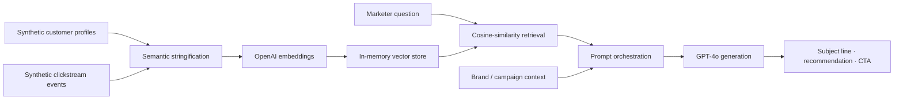
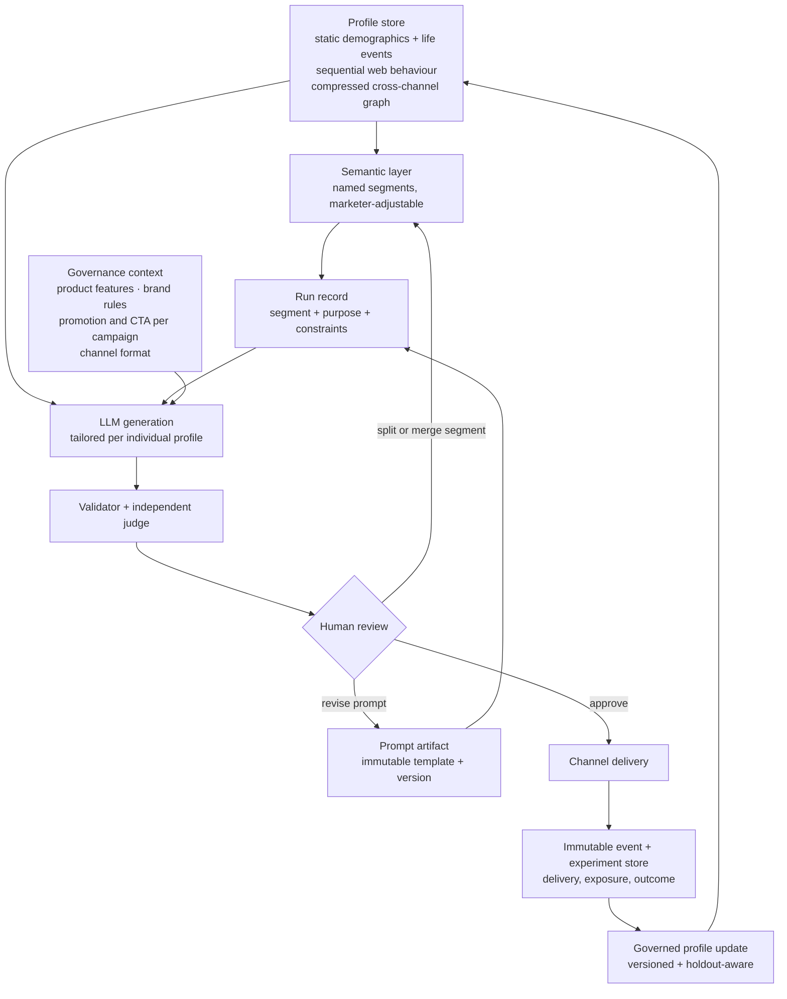

# Architecture: today and the target loop

This document separates what runs today from what is designed. Every box below carries one of two labels: **implemented today**, or **designed, not built**. The roadmap that closes the distance is in [roadmap.md](roadmap.md).

## What runs today

The implemented path is single-pass and session-local: synthetic data, in-memory retrieval, one generation for the closest-matching profile. Retrieved matches are displayed with their similarity scores; copy is generated for the top match only. Brand and campaign context enter prompt orchestration after retrieval; they are not embedded into the stored user profile.

## The target loop

### Status of each stage

| Stage | Status |
|---|---|
| Profile store — synthetic demographics and clickstream, embedded | **Implemented today** (synthetic, in-memory, no life-event updates, no graph signal) |
| Semantic layer — named, marketer-adjustable segments | Designed, not built |
| Prompt artifact — immutable template and version | Designed, not built (prompts are inline strings today) |
| Run record — prompt version plus segment, purpose, constraints, model, parameters and context | Designed, not built |
| LLM generation — tailored per individual profile | **Implemented today**, for the top-matching profile only |
| Governance context — product features, brand rules, campaign CTA, channel format | Designed, not built as a governed layer (brand context is passed today; no constraint enforcement) |
| Validator and independent judge | Designed, not built |
| Human review of evaluation results and segment boundaries | Designed, not built as a formal gate |
| Channel delivery | Designed, not built — requires production integrations |
| Immutable event and experiment store | Designed, not built — required before outcome-driven profile updates |
| Governed profile update | Designed, not built — versioned and checked against holdouts |

### Why stable semantics make comparisons interpretable

Generation is per person. Evaluation is not a single thing, and only one of its levels needs segments: a deterministic validator runs per output, regression tests run per golden case, comparative evaluation runs per frozen cohort, and safety, privacy and brand compliance apply across the whole system. It is the comparative level that requires a stable population, and that is the reason the semantic layer sits where it does.

A model can tailor copy to any individual profile it retrieves, so segments are not needed to generate. They are needed to **compare**: a single output is an anecdote, and judging whether a prompt change helped requires aggregating over a stable population. If segment definitions drift between runs, a difference in results cannot be attributed to the prompt, and the experiment answers nothing.

Keeping the segment human-readable and marketer-adjustable follows from the same logic. The person best placed to notice that a segment has stopped being coherent — because copy lands for half of it and misses the other half — is the marketer reading the outputs. Splitting or merging segments is their judgement to make, not a clustering threshold's.

The validator and judge do not rewrite either the prompt or the segment automatically. They surface evidence to a human review gate. The human can approve delivery, revise the prompt version, or revisit the segment boundary. The judge receives the task specification, the output constraints, the retrieved context and the generated output, scored against a separately versioned rubric; it does not receive the generator's reasoning. Record identity is verified before evaluation rather than inherited silently from generation state.

## Honest scope

This repository is a prototype and a learning environment for AI-native marketing primitives, not production infrastructure. Nothing in the target loop beyond the stages marked "implemented today" exists in code here.
